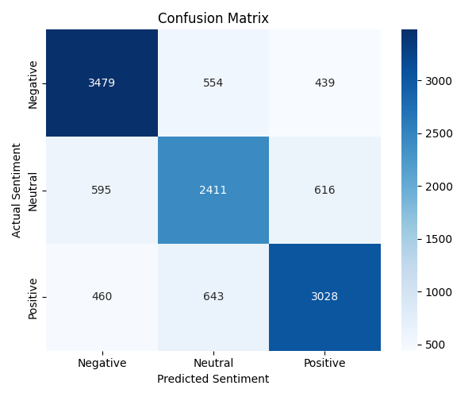

# 🧠 Multi-Class Twitter Sentiment Classifier

A Natural Language Processing project that classifies real-world tweets as **Positive**, **Negative**, or **Neutral** using **TF-IDF** and **Logistic Regression**, with a live command-line demo for predicting sentiment on your own text.


---

## 📌 Overview

This project implements a complete, end-to-end sentiment analysis pipeline on noisy, real-world social media text. It covers text cleaning, feature extraction, model training, evaluation, and interactive prediction, all in a single readable script.

Built as part of the **Progree Remote Internship Program (Artificial Intelligence track)**.

## ✨ Features

- **Full preprocessing pipeline:** lowercasing, punctuation removal, tokenization, stop-word removal, and lemmatization
- **TF-IDF feature extraction** capped at the 3,000 most informative terms
- **No data leakage:** the vectorizer is fit on training data only
- **Stratified 80/20 train/test split** with a fixed seed for reproducibility
- **Detailed evaluation:** accuracy, per-class precision/recall/F1, macro & weighted F1, and a confusion matrix
- **Live prediction mode:** type any sentence and get its sentiment instantly

## 📊 Results

Evaluated on a held-out test set of **12,225 tweets**:

| Metric | Score |
|---|---|
| **Accuracy** | 73% |
| **Macro F1-score** | 0.7256 |
| **Weighted F1-score** | 0.7294 |

**Per-class performance:**

| Class | Precision | Recall | F1-Score | Support |
|---|---|---|---|---|
| Negative | 0.77 | 0.78 | 0.77 | 4,472 |
| Neutral | 0.67 | 0.67 | 0.67 | 3,622 |
| Positive | 0.74 | 0.73 | 0.74 | 4,131 |

### Confusion Matrix



**Key takeaways:**
- **Negative** was the easiest class to identify (3,479 of 4,472 correct).
- **Neutral** was the hardest to separate, since neutral language often shares vocabulary with mildly positive or negative statements. This is a well-known challenge in sentiment analysis.
- **Positive** was also classified strongly (3,028 of 4,131 correct).

## 🗂️ Dataset

**Twitter Entity Sentiment Analysis** from [Kaggle](https://www.kaggle.com/datasets/jp797498e/twitter-entity-sentiment-analysis).

- ~74,000 labeled tweets in the training file
- Original classes: Positive, Negative, Neutral, Irrelevant
- The **Irrelevant** class was excluded to keep the task a clean 3-class problem
- Only the `text` and `sentiment` columns are used

## 🛠️ Tech Stack

| Library | Purpose |
|---|---|
| `pandas` | Dataset loading and cleaning |
| `numpy` | Numerical operations |
| `nltk` | Stop-word removal and lemmatization |
| `scikit-learn` | TF-IDF, train/test split, Logistic Regression, evaluation |
| `matplotlib` / `seaborn` | Confusion matrix visualization |

## ⚙️ How It Works

```
Raw tweet
   ↓
Lowercase → remove punctuation/digits → tokenize
   ↓
Remove stop-words → lemmatize
   ↓
TF-IDF vectorization (3,000 features)
   ↓
Logistic Regression
   ↓
Predicted sentiment: Positive / Negative / Neutral
```

**Example of preprocessing:**

```
Original:      "I was really enjoying these amazing products!"
After cleaning: "really enjoy amazing product"
```

## 🚀 Getting Started

### 1. Clone the repository

```bash
git clone https://github.com/yousafshah7/Twitter-Sentiment-Classifier.git
cd Twitter-Sentiment-Classifier
```

### 2. Install dependencies

```bash
pip install -r requirements.txt
```

### 3. Run the classifier

```bash
python sentiment_classifier.py
```

NLTK resources (`punkt`, `stopwords`, `wordnet`) are downloaded automatically on the first run.

> **Note:** `twitter_training.csv` must be in the same folder as the script.

## 💬 Usage Example

After training and evaluation, the program starts an interactive session:

```
===== SENTIMENT PREDICTION =====
Enter your text: I absolutely love this new update! Everything is working perfectly.
Predicted Sentiment: Positive

Enter another sentence? (yes/no): yes
Enter your text: This service is terrible. I've been waiting for hours.
Predicted Sentiment: Negative

Enter another sentence? (yes/no): yes
Enter your text: The company announced its new product will be released next Monday.
Predicted Sentiment: Neutral
```

## 📁 Project Structure

```
├── sentiment_classifier.py    # Main script: preprocessing, training, evaluation, live prediction
├── twitter_training.csv       # Training dataset
├── twitter_validation.csv     # Validation split from the Kaggle dataset
├── confusion_matrix.png       # Generated confusion matrix
├── requirements.txt           # Python dependencies
└── README.md
```

## 🔮 Future Improvements

- Try stronger models (SVM, Naive Bayes, or transformer-based models like BERT)
- Add n-grams (bigrams/trigrams) to TF-IDF to capture phrases
- Tune hyperparameters with cross-validation
- Evaluate on `twitter_validation.csv` as an additional test set
- Wrap the model in a simple web app (Streamlit or Flask)

## 👤 Author

**Yousaf Shah**

- 💼 LinkedIn: [Yousaf Shah](https://www.linkedin.com/in/yousaf-shah-88439842a)
- 🐙 GitHub: [yousafshah7](https://github.com/yousafshah7)

---

⭐ If you found this project useful, consider giving it a star!
